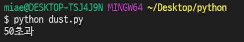
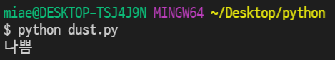
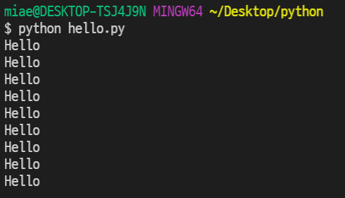
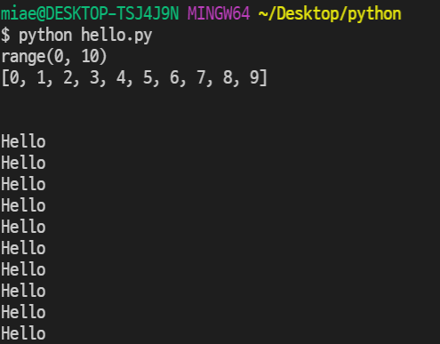

## 컴퓨터 프로그래밍 언어

### 	컴퓨터 프로그래밍 언어란?

​	`*`컴퓨터 => 계산하는 기계	`*`프로그래밍 => 명령어의 집합 	`*`언어 => 말

- 프로그래밍 언어도 영어의 문법요소 처럼 3형식이 있다. `1.저장, 2.조건, 3.반복`

### 	

### 	프로그래밍 언어가 쉬워졌다.

- 언어의 진화 : 어셈블리어 => C언어 => 파이썬
  - 파이썬의 장점 : 쉽다, 많은 사람들이 사용한다, 많은 것을 할 수 있다.

### 	

### 	프로그래밍 환경의 좋아졌다.

- 오픈 소스 라이센스 등장 : 제작자의 권리를 지키면서, 누구나 코드 열람이 가능하고, 기술활용의 원천

- 모든 것을 스스로 제작했던 환경이 만들어진 것을 활용하는 환경으로 변화했다.
- 기술 생산이 아닌 기술활용을 이용하여, 기술의 이해만 있다면 누구든 활용이 가능한 세상
  - 아마존 (AWS)가 대표적인 예시.


## IDE / 텍스트에디터

IDE : '특정언어를 위한' 통합개발환경 (Pycharm) 

텍스트에디터 : 메모장수준 ( Vscode )

데이터분석에 활용해 바로 결과를 볼 수 있는 활경 (Jupyter notebook)


## 파이썬 : 기초

(1) 대/소문자  (2) 띄어쓰기  (3)  스펠링  이 기본적으로 잘 되어야 오류를 줄일 수 있고 가독성이 좋다.


> ### 저장 : assignment 할당하다, Dust에 60을 저장(할당)한다.

- 무엇을 저장하는가? 1) 숫자 2)글자 "" 3) 참/거짓 T,F 부울(조건,반복에 사용)
- 어떻게 저장하는가? 
  - 1)변수 : 박스(dust) 1개 `dust = 40`
  - 2)리스트(Array,List) : 박스(dust)를 여러개 이어붙이자, 0부터 시작, `dust = [40,50,80]` 
  - 3)딕셔너리: 견출지 붙인 박스(dust)들의 묶음, key : value, key를 이용하여 value값에 접근 `dust = {'영등포구':40, '강남구':50}`
    - 실습 2 : 점심메뉴 리스트 

- 위에서 아래로, 오른쪽에서 왼쪽으로 흐름제어!

> ### 조건 : 어떠한 condition(조건)일 때 실행된다.

- indentation(tap)을 기반으로 하고 있다.

```python
if dust > 50 :
    print('50초과')  # 앞에 띄어쓰기 4번
else :				# else 옆에 : 무조건
    print('50이하')
```

- if 변수 dust가 50을 초과한다면
  - 문자열 '50초과'를 출력

- 변수 dust가 조건에 맞지 않는다면
  - 문자열 '50이하'를 출력



> 다중조건 : if / elif / else

```python
dust = 100

if dust > 150 : 
    print('매우 나쁨')

elif dust > 80 :
    print('나쁨')

elif dust > 30 :
    print('보통')

else :
    print('좋음')
    print('여행가자!')
```

- dust 변수에 숫자 100을 저장

- if 변수 dust가 150 초과이면

  - 문자열 '매우 나쁨' 출력

- elif  변수가 80 초과이면

  - 문자열 '나쁨' 출력

- elif 변수가 30 초과이면

  - 문자열 '보통' 출력

- else 변수가 위 조건에 아무것도 맞지 않으면

  - 문자열 '좋음' 출력

  - 문자열 '여행가자!' 출력

    

    

### 	반복 :

#### 	1. while문 : 해당하는 조건일 동안 계속 반복, 종료조건이 반드시 필요!

```python
greeting = "Hello"

i = 0 # 구조를 잡는 것이 핵심

while i < 10 : # 해당 조건이 False가 되면 종료!
     print(greeting)
     i = i + 1
```

- 문자열 "Hello"를 변수 greeting에 저장

- 숫자 0을 변수 i에 저장

- 변수 i가 숫자 10미만일 때까지 while문을 반복

  - 변수 greeting을 출력

  - 변수 i 에 1을 더한 값을 변수 i에 저장 

    

    

#### 	2. for문 :  정해진 범위 내에서 계속 반복, 종료조건이 필요 없음

```python
greeting = "Hello"

print(range(0,10))
print(list(range(0,10)))

print("\n")

for i in range(0,10,1) :
    print(greeting)
```

- range(0,10,1) : 0이상 10미만까지 +1까지 리스트를 만드는 함수

- for 변수 in 리스트 : 변수가 리스트를 돌아가는 동안 for문이 진행되는 것

  - 변수 i가 리스트 range(0,10,1) 범위 내에서 for문을 반복

  - 변수 greeting을 출력

  - 변수 i는 자동으로 리스트 범위를 이동

    