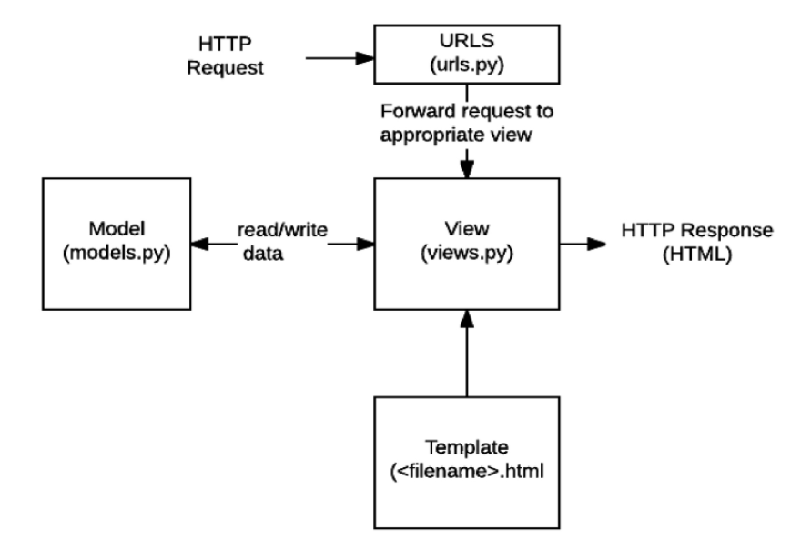

# 0304 

## 구조



### 앱 단위의 MTV 패턴을 가지고 있을 때

- project/urls.py

  

- project/articles/urls.py

  

### 어떻게 요청 처리를 하는가?

#### URL -> View -> Template 순

- URL

  > 등록된 urlpatterns에서 탐색

  - 왜 이름을 붙였어?

    views.py, template.html 에서 영향을 받지 않도록 변수화시켰음!

- View

  > 뷰 함수에 대한 첫번째 매개변수로 요청값(사용자 요청 정보 - HttpRequest) 전달

- Template

  > 파이썬 코드의 결과와 반복, 조건을 통해 동적HTML을 만들어나가서 직접 보이는 부분의 역할

  - 등록된 App 순서로 탐색 => 다른 앱에 같은 파일이 있으면 오류나니까settings.py => APP_DIRS = True


#### Form 요청처리

-  view.py에서 Form을 통한 요청

  ```python
  def throw(request):
      return render(request, 'articles/throw.html')
  ```

  이 때 template인 throw.html

  ```django
  
  
  
  <h1>THROW</h1>
  <form action="" method="GET">
    <label for="message">Throw</label>
    <input type="text" id="message" name="message">
    <input type="submit">
  </form>
  <a href="">뒤로</a>
  
  ```

  결과를 나타낼 view.py

  ```python
  def catch(request):
      message = request.GET.get('message')
      context = {
          'message': message,
      }
      # print(request)
      # print(request.META)
      # print(type(request))
      # print(request.GET)
      # print(request.GET.get('message'))
      return render(request, 'articles/catch.html', context)
  
  ```

  이  때 catch.html

  ```django
  
  
  
  <h1>CATCH</h1>
  <h2>여기서 {{ message }}를 받았다!!</h2>
  <a href="">뒤로</a>
  
  ```

- url은 어떻게 생겼을강

  ```python
  path('throw/', views.throw, name='throw'),
  path('catch/', views.catch, name='catch'),
  ```

  

  