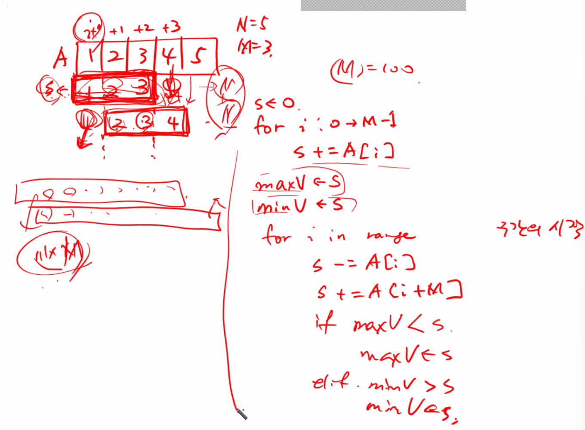

# 실습


## [SWEA] 4828. min max [D2]

```python
T = int(input())
for tc in range(1, T+1):
    N = int(input())
    lst = list(map(int, input().split()))
    
    max_num = lst[0]
    min_num = lst[0]
    
    # max
    for i in range(len(lst)):
        if lst[i] > max_num:
            max_num = lst[i]
    # min
    for j in range(len(lst)):
        if lst[j] < min_num:
            min_num = lst[j]
            
    print(f'#{tc} {max_num - min_num}')
```


## [SWEA] 4835. 구간합[D2]

```python
T = int(input())
for tc in range(1, T+1):
    N, M = map(int, input().split())
    lst = list(map(int, input().split()))
    
    re = []
    # 부분리스트
    for i in range(len(lst)-M+1):
        lst2 = lst[i:i+M]			#이중for문을 대신한 코드
        cnt = 0
        for j in range(len(lst2)):
            cnt += lst2[j]
        re.append(cnt)
    # re : 각각의 부분합 리스트
    min_num = re[0]
    max_num = re[0]
    
    # min
    for i in range(len(re)):
        if re[i] < min_num:
            min_num = re[i]
    # max
    for i in range(len(re)):
        if re[i] > max_num:
            max_num = re[i]
            
    print(f'#{tc} {max_num - min_num}')
```

re = [0]*N [크기가 정해진 배열을 만드는게 시간이 더 빨라]

​	re[i]=cnt

누적합

```python
T = int(input())
for tc in range(1, T+1):
    N, M = map(int, input().split())
    lst = list(map(int, input().split()))
    # 최대 100개 주어질 수 있고 최대 10000이내 => 백만을 넘지 않음
    min_num = 1000000
    max_num = 0
    for i in range(N-M+1):
        #s = sum(lst[i:i+M])
        s = 0
        for j in range(M):
            s += lst[i+j]
        if min_num > s:
            min_num = s
        if max_num < s:
            max_num = s
    print(f'#{tc} {max_num - min_num}')
```


> 하나빼고 하나더하는 식으로해보자 ( M : 엄청크면 힘들어)

- 


## [SWEA] 4831. 전기차

```python
T = int(input())
for tc in range(1, T+1):
    K, N, M = map(int, input().split())
    lst = list(map(int, input().split()))

    charger = [0] + lst + [N]   # N : 종점번호
    cnt = 0
    last = 0                   # last : 마지막 충전위치
    for i in range(1, M+2):     # 도착확인할 정류장 인덱스
        if charger[i] - charger[i-1] > K:
            cnt = 0
            break;
        elif charger[i] - last > K: # 마지막 충전위치로부터 다음 위치까지 갈 수 없니
            last = charger[i-1]
            cnt += 1
    print(f'#{tc} {cnt}')
```

