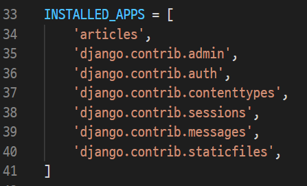
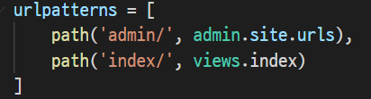
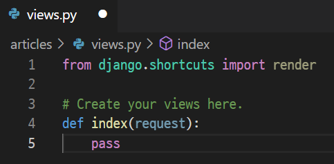
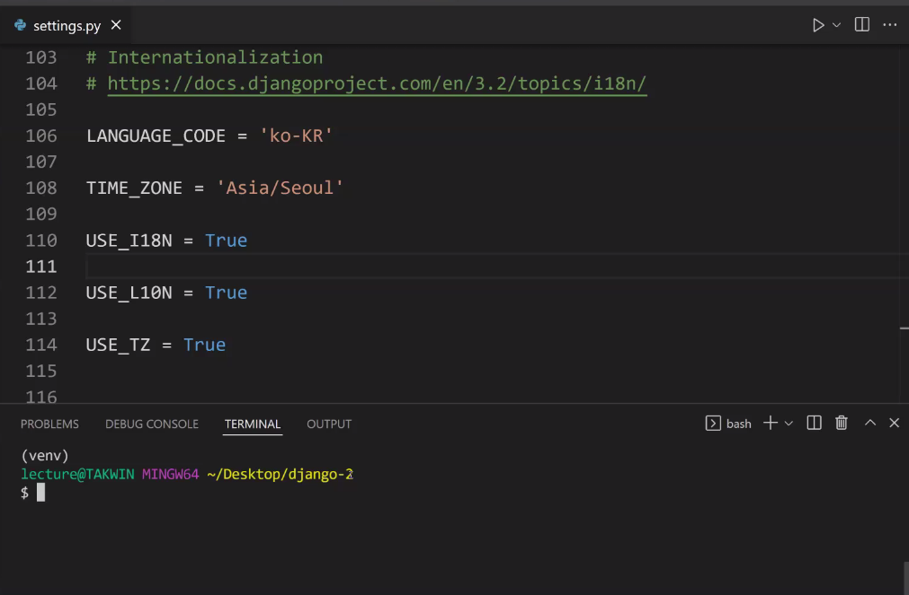
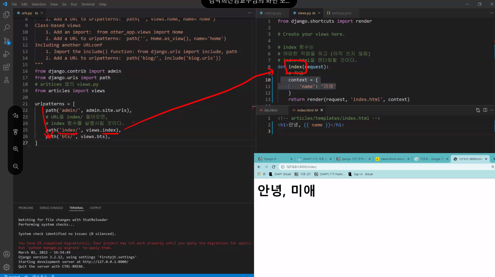

0302


## Django : 장고

> Python Web framework

### #용어

클라이언트  -----------요청----------> 서버

(웹 브라우저)<--------응답----------- (django)


### Web framework

- Static web page ( 정적 웹 페이지 ) 
  - 서버에 미리 저장된 파일이 사용자에게 그대로 전달되는 웹 페이지
  - 모든 상황에서 모든 사용자들에게 동일한 정보를 표시

- Dynamic web page ( 동적 웹 페이지 )
  - 웹 페이지에 대한 요청을 받은 경우 서버는 추가적인 처리 과정 이후 클라이언트에게 응답을 보냄
  - 동적 웹 페이지는 방문자와 상호작용하기 때문에 페이지 내용은 그때그때 다름

- Framework 
  - 개발을 하는데 있어서 환경을 제공을 해주겠다.
  - 프로그래밍에서 특정 운영 체제를 위한 응용 프로그램 표준 구조를 구현하는 클래스와 라이브러리 모임

- Framework Architenture

  - MVC Design Pattern (model-view-controller) - 소프트웨어 공학에서 사용되는 디자인 패턴 중 하나
  - Django는 MTV (model-template-view) Pattern

- MTV Pattern

  - model : 데이터베이스 기록을 관리

  - Template : 실제 내용을 보여주는 사용

  - View : HTTP 요청을 수신하고 HTTP 응답을 반환

    ​			template에게 응답의 서식을 맡김
    
    

## Django Intro

- 가상환경설정 및 활성화 ->  django 설치 -> 프로젝트 생성 -> 서버 켜서 로켓 확인하기
- 주의사항! 프로젝트 이름에 python 이나 django에서 사용중인 키워드 X , 하이픈 - 안됨!
- 일반적으로 application 이름은 복수형으로

### 가상환경

> 프로젝트별로 pip로 설치되는 패키지를 독립적으로 관리하기 위하여 

- 가상환경 생성

```bash
$ python -m venv venv
```

- 가상환경 실행
  * `venv` 폴더 내의 스크립트를 실행 시키는 것


```bash
$ source venv/Scripts/activate
(venv)
```

- 가상환경 종료

```bash
$ deactivate
```


### Django 설치

```bash
$ pip install django==3.2.12
```

* 혹시라도 4.x 버전을 설치한 경우 삭제 후 재설치 

```bash
$ pip uninstall django
```


### Project 생성

```bash
$ django-admin startproject intro .
```


### App 생성

```bash
$ python manage.py startapp pages
```


### Django 서버 실행

* 서버 종료는 `ctrl + c` 로 한다.

```bash
$ python manage.py runserver
```


- 프로젝트는 앱의 모임
  - 반드시!!!! 앱을 **생성** 후 프로젝트에다가 **등록**해야해



- trailing comma
  - 

- views - request 무조건

  

## **setting 과목평가 빈출**




요청이 들어와요 url 목록이 있는데 목록에 대응되는 view가 있다 적절한 view와 연결,  실행을 시켜

view와 관련된 (반복문조건문으로 씌여진) template 를 불러와




## URLS -> VIEWS -> TEMPLATE

### 1. urls.py

```python
from django.contrib import admin
from django.urls import path
from pages import views

urlpatterns = [
    path('admin/', admin.site.urls),
    path('dinner/<name>/<int:id>/', views.dinner),
]

```


### 2. view.py

```python
from django.shortcuts import render

# Create your views here.
def dinner(request, name, id):
    context = {
        'name' : name,
        'id' : id
    }
    return render(request, 'dinner.html', context)
```


### 3.template.html

```django
<h1> 저녁 메뉴 </h1>
<h1> 나랑 저녁 먹을 사람? {{ id }}명 </h1>
<h1> 뭐 먹을랭 1>
```
