# 0308 

## Django 처음 복습

### 환경 설정

1. 가상환경 실행

```bash
$ python -m venv venv
```

2. venv 폴더 안에있는 Scripts 폴더안에있는 activate를 실행시킨다.

```bash
$ source venv/Scripts/activate
(venv)
```

3. 만약에 git을 쓸거라면 : gitignore 폴더를 생성 => git을 쓰기 위해서 

```text
venv/
__pycache__/
```

4. 장고설치

```bash
$ pip install django==3.2.12
```

5. 프로젝트 및 앱 생성

- 프로젝트 만들 때 . 꼭 써라

```bash
$ django-admin startproject pjt .
(venv) 
miae@DESKTOP-TSJ4J9N MINGW64 ~/Desktop/Django_0308

```

- app 생성

  - app 생성

    ```bash
    $ python manage.py startapp pages
    (venv) 
    ```

  - app 등록 및 언어설정

    - 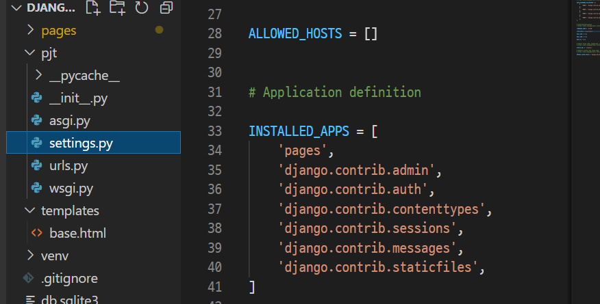

      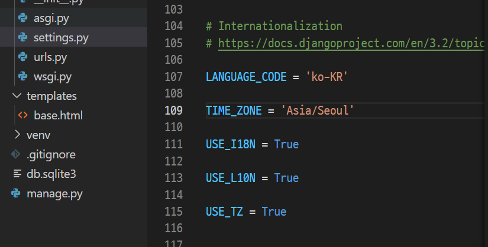

  - app urls 분리

    - 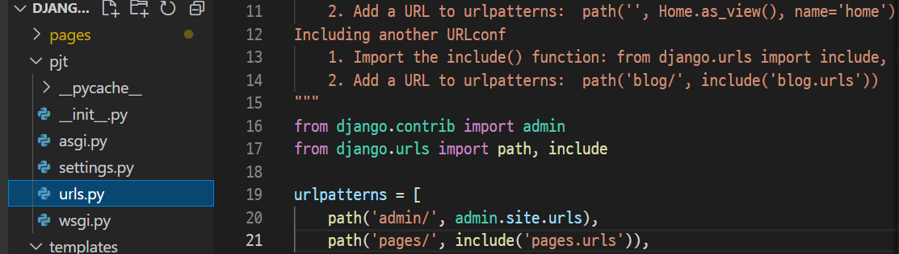
    - 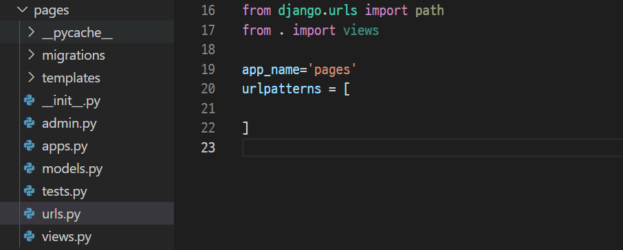
      - path는 django.urls에 있다!
      - views는 현재 경로(app 즉 pages)에 있다.

### 요청처리흐름

> 장고는 html등의 요청에 대한 응답 처리 기능

- pages/urls

  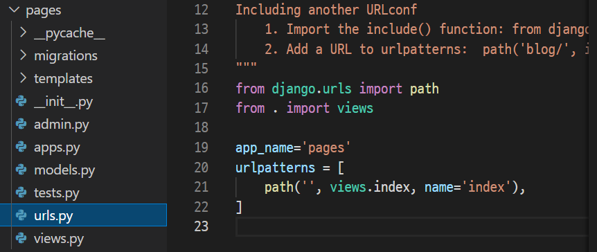

- pages/views

  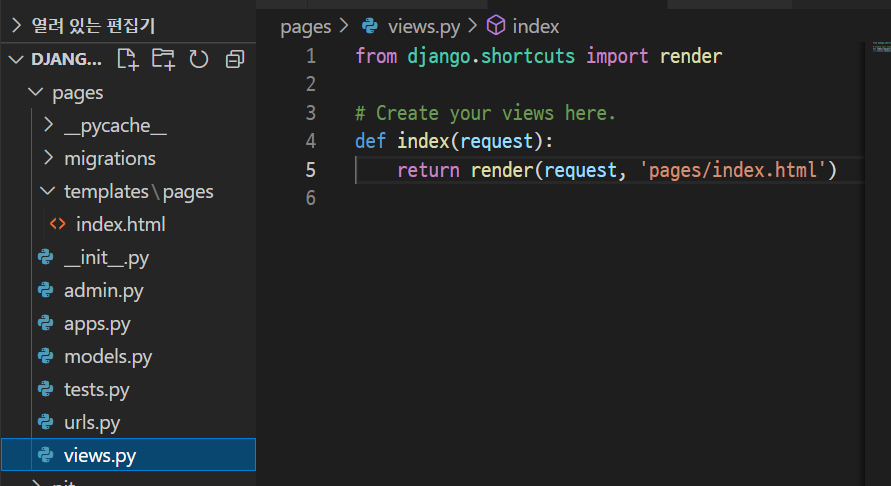


- 서버 실행시키기 및 종료

  ```bash
  $ python manage.py runserver
  
  ctrl + c
  ```

  

- 전체적인 흐름

  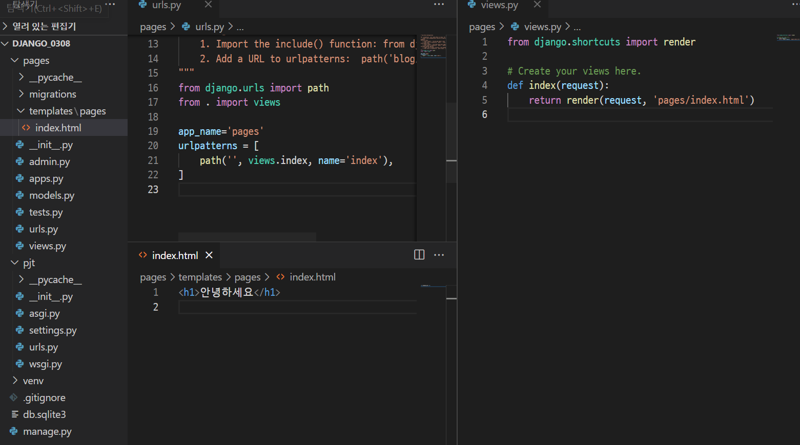

- 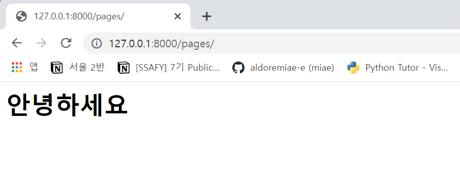		

### 탬플릿 상속

- pjt/settings

  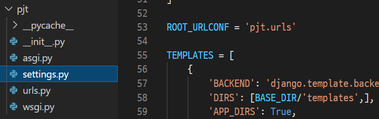

- templates/base.html

  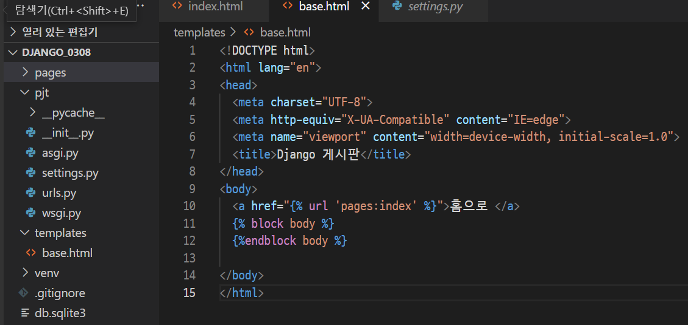

- pages/templates/pages/index.html

  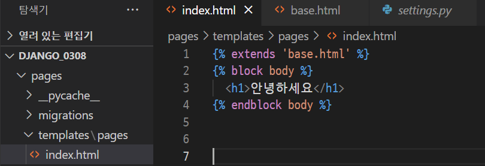

- 결과

  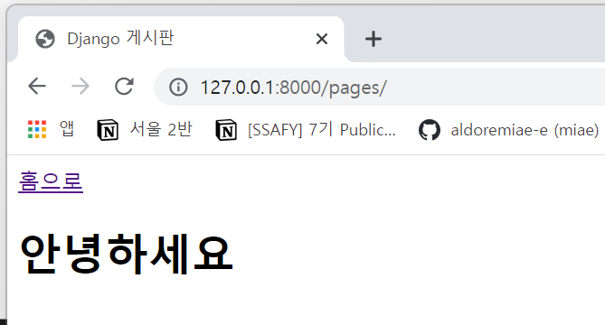