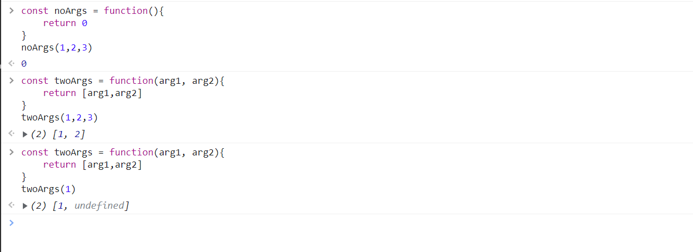

# 🌻0426 js_1 함수

[TOC]

## 🐣함수

> 참조 타입 중 하나로서, function 타입에 속함

- JavaScript 에서 함수를 정의하는 방법은 **함수 선언식**, **함수 표현식**

  - *JavaScript의 함수는 일급객체에 해당*

    - *일급객체 : 변수에 할당 가능, 함수의 매개변수로 전달 가능, 함수의 반환 값으로 사용 가능*
    - *django의 @데코레이터*

    

### 🐤함수를 정의하는 방법

- 함수 선언식

  - 함수이름, 매개변수, 바디

    ```javascript
    function name(args) {
        // do something
    }
    ```

- 함수 표현식

  - 함수의 이름을 생략하고 익명 함수로도 가능 : 함수이름(생략가능), 매개변수, 바디

    ```javascript
    const name = function(args){
    	// do something
    }
    ```

  |        | 함수 선언식                                                  | 함수 표현식                         |
  | ------ | ------------------------------------------------------------ | ----------------------------------- |
  | 공통점 | 데이터 타입, 함수 구성요소                                   | 데이터 타입, 함수 구성요소          |
  | 차이점 | 익명 함수 불가능<br />호이스팅 가능 (함수 호출 이후에 선언해도 동작) | 익명 함수 가능<br />호이스팅 불가능 |
  | 비고   |                                                              | Airbnb Style Guide 권장 방식        |


- 매개변수와 인자의 개수 불일치를 허용

  

  

- 🐔Rest Parameter : 함수가 정해지지 않은 수의 매개변수를 배열로 받음

  ```javascript
  const restOpr = function(arg1, arg2, ...restArgs){
      return [arg1,arg2,restArgs]
  }
  > restOpr(1,2,3,4,5)
  < (3) [1, 2, Array(3)]
  ```

  

- 🐔Spread operator : 배열 인자를 전개하여 전달 가능

  ```javascript
  const spreadOpr = function(arg1, arg2, arg3){
      return arg1+arg2+arg3
  }
  const numbers = [1,2,3]
  
  > spreadOpr(...numbers)
  > 6
  ```

  

### 🐤화살표 함수 (Arrow Funtion)

- 함수를 비교적 간결하게 정의할 수 있는 문법
- **function 키워드 생략 가능**
- 함수의 **매개변수**가 단 하나 뿐이라면, () 도 생략 가능
- 함수의 **body가 표현식** 하나라면 {}와 retrun 도 생략 가능

```
- 함수에 대한 typeof 연산자의 결과는 function이다
- 함수 선언식은 반드시 함수 이름을 지정해야 하므로 익명 함수로 선언이 불가능하고, 함수 표현식은 익명 함수 선언이 가능하다
- 화살표 함수는 바디가 한줄이면 중괄호 return 구문 생략 가능하다.
```


### 🐤문자열 메서드 목록

| method               | 설명                                                         | 비고                                              |
| -------------------- | ------------------------------------------------------------ | ------------------------------------------------- |
| includes()           | 특정 문자열의 **존재여부를 참 거짓**으로 반환                |                                                   |
| split('나눌 조건')   | 문자열을 토큰 기준으로 **나눈 배열** 반환                    | 인자가 없으면 기존 문자열을 배열에 담아 반환      |
| replace('from','to') | 해당 문자열을 대상 **문자열로 교체**하여 반환 (처음거 하나만) | replaceAll(모두)                                  |
| trim()               | 문자열의 **좌우 공백 제거**하여 반환                         | trimStart(좌측만제거),  <br />trimEnd(우측만제거) |


## 🐣배열(Array)

- 키와 속성들을 담고 있는 참조 타입의 객체(object)

- 순서 보장

- 대괄호 새용, 0을 포함하는 양의 정수 인덱스로 특정 값에 접근 가능

- 배열의 길이 :  array.length

  - 배열의 마지막 원소 array.length - 1

  ```javascript
  const number[1, 2, 3, 4, 5]
  console.log(number[0])
  > 1
  console.log(number[-1])
  > undefined
  console.log(number.length)
  > 5 (길이)
  console.log(number.length-1)
  > 4 (길이-1)
  console.log(number[number.length-1])
  > 5 (길이-1 을 인덱스로 갖는 값)
  ```


### 🐤배열관련 메서드

| 기본 메서드           | 설명                                             | 비고                    |
| --------------------- | ------------------------------------------------ | ----------------------- |
| array.reverse()       | 원본 배열의 요소들의 순서를 반대로 정렬          |                         |
| array.push & pop      | 배열 가장 뒤에 요소를 추가/ 제거                 |                         |
| array.unshift & shift | 배열 가장 앞에 요소를 추가/ 제거                 |                         |
| array.includes        | 배열에 특정 값이 존재하는지 판별 후 참/거짓 반환 |                         |
| array.indexOf         | 배열에 특정 값이 존재하는지 판별 후 인덱스 반환  | 없으면 -1 반환          |
| array.join            | 배열의 모든 요소를 구분자를 이용하여 연결        | 구분자 생략시 쉼표 기준 |

- 🐔Spread operator : 배열 내부에서 배열 전개 가능

  ```javascript
  const array = [1, 2, 3]
  const newArr = [0, ...array, 4]
  
  console.log(newArr)
  > (5) [0, 1, 2, 3, 4]
  ```

| 심화 메서드   | 설명                                                         | 비고                                                         |
| ------------- | ------------------------------------------------------------ | ------------------------------------------------------------ |
| array.forEach | 배열의 각 요소에 대해 콜백 함수를 **한 번씩 실행**<br />`arr.forEach((num, index) => {console.log(num)})` | 콜백함수는 3가지 매개변수로 구성<br />- element, index, array<br />반환 값(return)이 없는 메서드 |
| array.map     | 콜백 함수의 **반환 값을 요소로 하는 새로운 배열** 반환<br />`const addNums = arr.map((num) => {return num + 1})` | 반환 값(return)을 통해 새로운 배열 만듬                      |
| array.filter  | 콜백 함수의 반환 값이 **참인 요소들만 모아서 새로운 배열**을 반환<br />`const filterArr = arr.filter((num) => { return num < 2})` |                                                              |
| array.find    | 콜백 함수의 반환 값이 참이면, 조건을 만족하는 **첫번째 요소**  반환 | `arr.find((배열값) => {return 배열값.key === 값})`           |
| array.every   | 배열의 **모든 요소가 주어진** 판별 함수를 통과하면 참을 반환하고, **빈 배열은 항상 참** |                                                              |
| array.some    | 배열의 요소 중 **하나라도**  주어진 판별 함수를 통과하면 참을 반환하고, 모든 요소가 통과 못하면 거짓 반환 |                                                              |
| array.reduce  | 콜백 함수의 반환 값들을 하나의 값(acc)에 **누적** 후 반환<br />`const result3 = numbers.reduce((acc, num) => {return acc + num}, 0)` | arr.reduce((누적값, 배열값) => {return 반환값}, 초기값)      |


```
students.map(function (student){
    return student.python + student.js
})
// 2. Array function
students.map((student) => {
    return student.python + student.js
})
students.map(student => {
    return student.python + student.js
})
students.map(student => student.python + student.js)
```


## 🐣객체 (object)

- 객체는 속성의 집합, 중괄호 내부 {key : value}쌍으로 표현
- key는 문자열 타입만 가능
  - key 이름에 띄어쓰기가 있으면 따옴표를 써서 `'na me'` 이런식으로 씀
- value는 모든타입 (함수 포함) 가능
- 객체 요소 접근은 점이나 대괄호[]로 가능하다
  - key이름에 띄어쓰기가 있으면 대괄호 `miae['na me']` 식으로 써줘야함


### 🐤객체와 메서드

- 메서드 : 객체의 속성이 참조하는 함수
- 객체.메서드명() 으로 호출 가능
- 메서드 내부에서 this 키워드가 객체를 의미한다


- 객체 관련 ES6 문법

  1. 속성명 축약(shortand) : 객체를 정의할  때 **key와 할당하는 변수의 이름이 같으면 ** 축약 가능

     `const bookShop = {books : books}` => `const bookShop = {books}`

  2. 메서드명 축약(shortand) : 메서드 선언시 **function**키워드 생략 가능

     `greeting: function(){ }` => `greeting() { }`

  3. 계산된 속성(computed property name) : 객체를 정의할 때 key의 이름을 표현식으로 이용하여 동적 생성 가능

  4. 구조 분해 할당(destructing assignment) : 배열 또는 객체를 분해하여 속성을 변수에 쉽게 할당

  5. Spread operator : (...)를 사용하면 객체 내부에서 객체 전개 가능, 얕은 복사에서 활용 가능


- JSON (JavaScript Object Notaion)
  - key-value 형태로 데이터를 표기하는 언어 독립적 표준 포맷
  - 자바 스크립트의 객체와 유사하게 생겼으나 실제로는 **문자열 타입**
  - JSON을 조작하기 위한 두가지 내장 메서드 제공
    - JSON.parse()
    - JSON.stringify()

