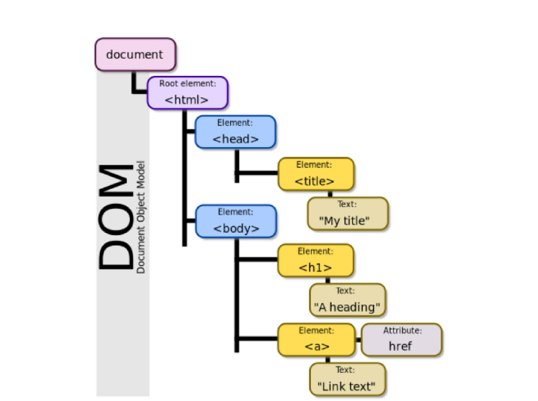
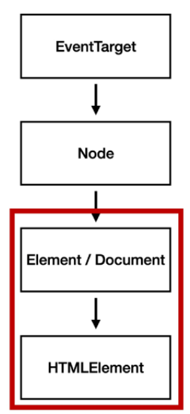
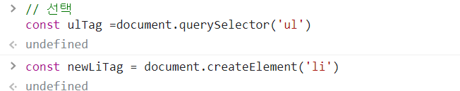
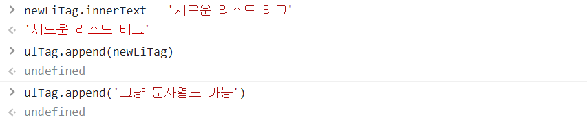
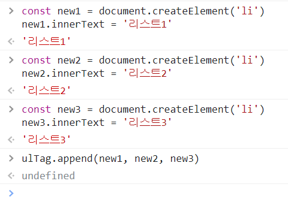
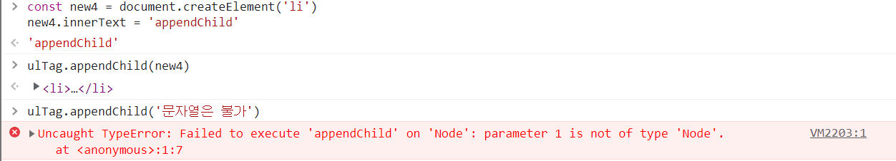
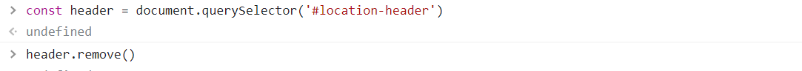
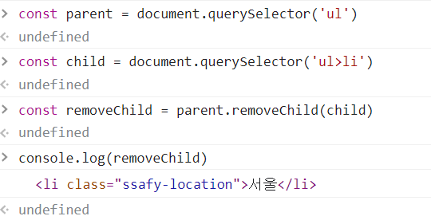

# 0427 js_2

[TOC]

## 🐣this

```javascript
const me = {
    firstName : 'Miae',
    lastName : 'Kim',
    fullName : this.firstName + this.lastName,
    getFullName : function(){
        return this.firstName + this.lastName
    }
}
```

```javascript
> me.fullName
> NaN

> me.getFullName()
> MiaeKim // this === me

> getFullName()
> 에러뜸
```


```javascript
function getFullName() {
    return this.firstName + this.lastName
}

const you = {
    firstName : 'Tony',
    lastName : 'Stark',
    getFullName : getFullName
}

> you.getFullName()
> 'TonyStark' //this === you

> getFullName()
> NaN //this === window
```


### 🐤 function 키워드와 화살표 함수의 차이

- forEach의 콜백함수의 경우 메서드가 this.___는 메서드가 아니기 때문에 호출 불가능하다

  - 때문에 콜백함수 내부의 this는 window가 되기 때문에 객체 내부로 접근 불가능하다

    - 콜백함수 내부에 접근하기 위해 **.bind(this) 메서드**를 사용해야한다

      - 번거로움을 극복한 것이 화살표 함수

      

  - 함수 내부에 this 키워드가 존재할 경우

    - 화살표 함수와 function 키워드로 선언한 함수가 다르게 동작한다.

  - 함수 내부에 this 키워드가 존재하지 않을 경우

    - 화살표 함수와 function 키워드로 선언한 함수가 완전히 동일하게 동작한다.


## 🐣lodash

> A modern JavaScript utility library

- 모듈성, 성능 및 추가 기능을 제공하는 JavaScript 유틸리티 라이브러리
- array, object 등 자료구조를 다룰 때 사용하는 유용하고 간편한 유틸리티 함수들 제공

- lodash를 사용하지 않을 경우, 깊은 복사는 직접 함수를 만들어서 구현해야한다.


## 🐣JS 역사

### 🐤 브랜던 아이크

- JS 최초 설계자
- 모질라 재단 공동 설립자
- 코드네임 피닉스 프로젝트 진행 - 파이어폭스의 전신

> 파편화 => 표준화

- 제 1차 브라우저 전쟁 이후 여러 브라우저에서 자체 JS 언어를 사용
- 크로스 브라우징 이슈 발생
  - 표준화의 필요성이 생김
    - Vanilla JavaScript


## 🐣DOM & BOM

### 🐤DOM

> Document Object Model

- HTML, XML 같은 문서를 다루기 위한 문서 프로그래밍 인터페이스

- 논리적 트리 모델 : 문서를 **구조화**하고, 구조화된 **구성 요소**를 하나의 **객체**로 취급



- 단순한 속성 접근, 메서드 활용 뿐만 아니라, 프로그래밍 언어 특성을 활용한 조작 가능( 반복, 조건 )
  - 주요 객체
    - window : DOM을 표현하는 창, 최상위 객체 (생략 가능)
    - document : 페이지 컨텐츠의 Entry Point, <body>같은 구성 요소(객체 취급)을 포함
    - 그 외 : navigator, location, history, screen

- **Pasing** (파싱)

  > 해석 : 브라우저가 문자열을 해석하여 DOM tree로 만드는 과정


### 🐤BOM

> Browser Object Model

- 자바스크립트가 브라우저와 소통하기 위한 모델
- 브라우저의 창, 프레임을 추상화해서 프로그래밍적으로 제어할 수 있도록 제공하는 수단
- **window 객체** 는 모든 브라우저로부터 지원받고, **브라우저의 창**를 지칭


## 🐣DOM 조작

> Document는 문서 한 장에 해당하고, 이를 조작

- 조작 순서 : 1. 선택(Select) 2. 변경(Manipulation)

- DOM 관련 객체의 상속 구조

  




### 🐤 DOM 선택 - `document.querySelector()`

- querySelector, querySelectorAll()을 사용하는 이유 :
  - id, class, tag선택자 등을 모두 사용 가능하므로, 더 구체적이고 유연하게 선택이 가능하다

- `document.querySelector(selector)`
  - 제공한 선택자와 일치하는 element 하나 선택
  - 제공한 CSS selector를 만족하는 첫번 째 element 객체를 반환 ,  없으면 null
- `document.querySelectorAll(selector)`
  - 제공한 선택자와 일치하는 여러 element 선택
  - 매칭 할 하나 이상의 selector를 포함하는 CSS selector를 문자열로 받음
  - 지정된 셀렉터에 일치하는 Nodelist를 반환


### HTML Collection & NodeList

- 둘 다 배열과 같이, 각 항목에 접근하기 위한 index 제공

  | HTML collection                              | NodeList                                                     |
  | -------------------------------------------- | ------------------------------------------------------------ |
  | name, id, index 속성으로 각 항목에 접근 가능 | index로만 각 항목에 접근 가능                                |
  | 메서드 사용 불가                             | 배열에서 사용하는 forEach 메서드 등 다양한 메서드 사용 가능  |
  | Live Collection => DOM 변경사항 실시간 반영  | Live Collection => DOM 변경사항 실시간 반영<br /><br />*단, guerySelectorAll()에 의해 반환되는 NodeList는 Static Collection으로 실시간 반영은 안됨* |

  

### 🐤 DOM 변경 - `Create, append, innerText, innerHTML`

- document.creatElement()

  - 작성한 태그 명의 HTML 요소를 생성하여 반환

    

- Element.append()

  - 특정 부모 Node의 자식 NodeList 중 마지막 자식 다음에 Node객체나 DOMString을 삽입

    

  - 여러개의 Node 객체나 DOMString 추가 가능

    

  - 반환 값 없음

- Node.appendChild()

  - 한 Node를 특정 부모 Node의 자식 NodeList 중 마지막 자식으로 삽입 (Node만 추가 가능)

    

  - 한번에 하나의 Node 만 가능

| 부모Node.append()                | Node.appendChild()            |
| -------------------------------- | ----------------------------- |
| 문자열 객체 추가 가능            | 문자열 안됨, Node 객체만 허용 |
| 반환값 없음                      | 추가된 Node객체 값 반환       |
| 여러 Node객체와 문자열 추가 가능 | 하나의 Node 객체만 추가 가능  |


- Node.innerText

  ```javascript
  new1.innerText = '<li>춘천</li>'
  > <li>춘천</li>
  ```

  

  - Node 객체와 그 자손의 텍스트 컨텐츠를 표현
  - 최종적으로 스타일링이 적용되는 모습으로 표현

- Element.innerHTML

  ```javascript
  new1.innerHTML = '<li>춘천</li>'
  > 춘천
  ```

  

  - 요소 내에 포함된 HTML 마크업을 반환
  - XSS (cross-site Scripting) 공격에 취약하므로 사용 시 주의


### 🐤 DOM 삭제 - `ChildNode.remove() , Node.removeChild()`

- ChildNode.remove()

  

  - Node가 속한 트리에서 해당 노드 제거

- Node.removeChild()

  

  - DOM에서 자식 Node를 제거하고 제거된 Node를 반환
  - Node는 인자로 들어가는 자식 노드의 부모 노드


### 🐤 DOM 속성 - `Element.setAttribute(name, value), Element.getAttribute(attributeName)`

- Element.setAttribute(name, value)

  ```javascript
  const header = document.querySelector('#location-header')
  header.setAttribute('class', 'ssafy-location')
  ```

  

  - 지정된 요소의 값을 설정
  - 속성이 존재하면 값을 갱신, 존재하지 않으면 지정된 이름과 값으로 새 속성 설정

- Element.getAttribute(attributeName)

  ```javascript
  const geta = document.querySelector('.ssafy-location') //.을 붙인다
  geta.getAttribute('class')
  > 'ssafy-location'
  ```

  

  - 해당 요소의 지정된 값을 반환
  - 인자는 값을 얻고자 하는 속성의 이름


## 🐣Event

> 네트워크 활동이나 사용자와의 상호작용 같은 사건의 발생을 알리기 위한 객체

- 역할 : "특정 이벤트가 발생**하면,** 할일을 등록**한다.**"


### 🐤 EventTarget.addEventListener(type, listener)

 1. 선택 : EventTarget = document.querySelector()

    ```javascript
    const myCI = document.querySeletor('#my-change-input')
    ```

    

 2. 미리 함수를 만든다면 : 

    ```javascript
    const changeColor = function(event) {
        const h2Tag = document.querySelector('h2')
        h2Tag.style.color = event.target.value // 요청한 값을 이벤트 타겟으로 함
    }
    ```

    

 3. EventTarget.addEventListener('작동', 함수(event){ 내용})

    혹은 EventTarget.addEventListener('작동', 함수이름)

    ```javascript
    myCI.addEventListener('input', changeColor)
    ```

    

### 🐤event.preventDefault()

- 현재 이벤트의 기본 동작을 중단